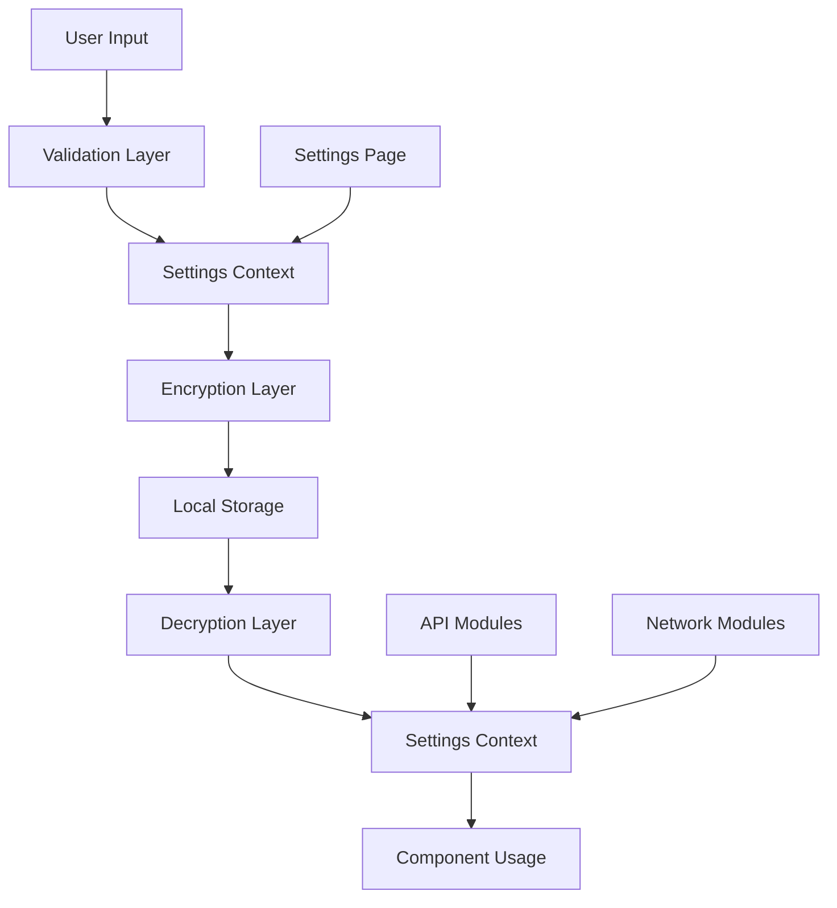

# Scorpius Settings System Guide

## Overview

The Scorpius Settings System provides a comprehensive, secure, and user-friendly way to manage all application configurations including API keys, network settings, and user preferences. The system is built with security, scalability, and ease of use in mind.

## Architecture

### Core Components

```
SettingsContext (Global State)
├── NetworkSettings (RPC Configuration)
├── APIKeysSettings (Service Integration)
├── GeneralSettings (User Preferences)
└── SecureStorage (Encryption Layer)
```

## Features

### 🔐 **Security**

- **Encrypted Storage**: API keys and sensitive data are encrypted locally
- **Tier-based Access**: Settings access controlled by user tier
- **Secure Masking**: Sensitive values are masked in the UI
- **Validation**: Input validation for all configuration values

### 🌐 **Network Configuration**

- **Multi-chain Support**: Ethereum, Arbitrum, Optimism, Base, Polygon, BSC
- **Custom RPC Endpoints**: Add your own blockchain networks
- **Connection Testing**: Validate RPC endpoints before saving
- **Default Fallbacks**: Automatic fallback to default providers

### 🔑 **API Key Management**

- **Service Integration**: OpenAI, Anthropic, Etherscan, CoinGecko, Alchemy, Infura, QuickNode, Moralis
- **Custom API Keys**: Add keys for unlisted services
- **Key Validation**: Format validation for known services
- **Tier Restrictions**: Premium services require appropriate tier

### ⚙️ **General Settings**

- **Theme Management**: Light, dark, and system themes
- **Auto-refresh**: Configurable refresh intervals
- **Notifications**: Desktop notifications and sound settings
- **Security**: Auto-lock timeout and authentication requirements
- **Performance**: Caching, batch sizes, and concurrent limits

## Usage Guide

### Quick Start

1. **Access Settings**

   ```typescript
   // Navigate to settings page
   window.location.href = "/settings";

   // Or use the settings tab in the main dashboard
   ```

2. **Use Settings in Components**

   ```typescript
   import { useSettings, useNetworkRpc, useApiKey } from '@/hooks/useSettings';

   function MyComponent() {
     const { settings, updateSetting } = useSettings();
     const ethereumRpc = useNetworkRpc('ethereum');
     const etherscanKey = useApiKey('etherscan');

     return (
       <div>
         <p>Ethereum RPC: {ethereumRpc}</p>
         <p>Theme: {settings.theme}</p>
       </div>
     );
   }
   ```

### Network Configuration

#### Adding RPC Endpoints

```typescript
import { useSettings } from "@/hooks/useSettings";

function NetworkConfig() {
  const { updateRpcUrl, addCustomRpc } = useSettings();

  // Update existing network
  updateRpcUrl("ethereum", "https://your-rpc-url.com");

  // Add custom network
  addCustomRpc("Avalanche", "https://api.avax.network/ext/bc/C/rpc");
}
```

#### Supported Networks

| Network  | Chain ID | Symbol | Default RPC  |
| -------- | -------- | ------ | ------------ |
| Ethereum | 1        | ETH    | Alchemy Demo |
| Arbitrum | 42161    | ETH    | Alchemy Demo |
| Optimism | 10       | ETH    | Alchemy Demo |
| Base     | 8453     | ETH    | Alchemy Demo |
| Polygon  | 137      | MATIC  | Alchemy Demo |
| BSC      | 56       | BNB    | Binance      |

### API Key Management

#### Configuring Service Keys

```typescript
import { useSettings } from "@/hooks/useSettings";

function APIConfig() {
  const { updateApiKey, addCustomApiKey } = useSettings();

  // Update service API key
  updateApiKey("etherscan", "YOUR_ETHERSCAN_API_KEY");

  // Add custom API key
  addCustomApiKey("Custom Service", "your-custom-api-key");
}
```

#### Supported Services

| Service       | Description                    | Tier Required | Key Format                 |
| ------------- | ------------------------------ | ------------- | -------------------------- |
| **Etherscan** | Blockchain data & verification | Community     | `[A-Z0-9]{34}`             |
| **OpenAI**    | GPT-based AI analysis          | Starter       | `sk-[a-zA-Z0-9]{20,}`      |
| **Anthropic** | Claude AI analysis             | Pro           | `sk-ant-[a-zA-Z0-9-]{20,}` |
| **CoinGecko** | Cryptocurrency market data     | Starter       | `CG-[a-zA-Z0-9]{20,}`      |
| **Alchemy**   | Enhanced blockchain APIs       | Starter       | `[a-zA-Z0-9_-]{32}`        |
| **Infura**    | Ethereum infrastructure        | Community     | `[a-f0-9]{32}`             |
| **QuickNode** | High-performance endpoints     | Pro           | `[a-zA-Z0-9_-]{20,}`       |
| **Moralis**   | Web3 development platform      | Starter       | `[a-zA-Z0-9_-]{20,}`       |

### General Settings

#### Theme Management

```typescript
import { useSettings } from '@/hooks/useSettings';

function ThemeToggle() {
  const { settings, updateSetting } = useSettings();

  const toggleTheme = () => {
    const newTheme = settings.theme === 'dark' ? 'light' : 'dark';
    updateSetting('theme', newTheme);
  };

  return (
    <button onClick={toggleTheme}>
      Current theme: {settings.theme}
    </button>
  );
}
```

#### Performance Configuration

```typescript
import { useSettings } from "@/hooks/useSettings";

function PerformanceSettings() {
  const { settings, updateSetting } = useSettings();

  // Configure concurrent scans (tier limited)
  updateSetting("maxConcurrentScans", 10);

  // Set refresh interval
  updateSetting("refreshInterval", 30); // seconds

  // Enable/disable caching
  updateSetting("cacheEnabled", true);
}
```

## Security Considerations

### Encryption

All sensitive data is encrypted using a local encryption layer:

```typescript
import {
  encryptSensitiveData,
  decryptSensitiveData,
} from "@/lib/settingsEncryption";

// Encrypt before storage
const encrypted = encryptSensitiveData(apiKey);

// Decrypt when retrieving
const decrypted = decryptSensitiveData(encrypted);
```

### Validation

Input validation is applied to all settings:

```typescript
import { validateApiKey, validateRpcUrl } from "@/lib/settingsEncryption";

// Validate API key format
const isValid = validateApiKey(key, "etherscan");

// Validate RPC URL
const isValidUrl = validateRpcUrl("https://rpc.url.com");
```

### Tier-based Access

Settings access is controlled by user tier:

```typescript
import { useLicense } from '@/hooks/useLicense';

function TierRestrictedSetting() {
  const { tier } = useLicense();

  // Pro features require pro tier or higher
  const canAccess = tier === 'pro' || tier === 'enterprise';

  return canAccess ? <ProSetting /> : <UpgradePrompt />;
}
```

## Data Flow



## Export/Import

### Export Settings

```typescript
import { useSettings } from "@/hooks/useSettings";

function ExportSettings() {
  const { exportSettings } = useSettings();

  const handleExport = () => {
    const settingsData = exportSettings();
    // Download as JSON file
    const blob = new Blob([settingsData], { type: "application/json" });
    // ... download logic
  };
}
```

### Import Settings

```typescript
import { useSettings } from "@/hooks/useSettings";

function ImportSettings() {
  const { importSettings } = useSettings();

  const handleImport = (jsonData: string) => {
    const success = importSettings(jsonData);
    if (success) {
      console.log("Settings imported successfully");
    }
  };
}
```

## Best Practices

### 1. **Use Hooks for Settings Access**

```typescript
// ✅ Good - Use dedicated hooks
const ethereumRpc = useNetworkRpc("ethereum");
const etherscanKey = useApiKey("etherscan");

// ❌ Avoid - Direct context access
const { settings } = useSettings();
const rpc = settings.rpcUrls.ethereum;
```

### 2. **Validate Before Using**

```typescript
// ✅ Good - Validate before use
const apiKey = useApiKey("etherscan");
if (apiKey && validateApiKey(apiKey, "etherscan")) {
  // Use API key
}

// ❌ Avoid - Use without validation
const apiKey = useApiKey("etherscan");
makeApiCall(apiKey); // Might fail if invalid
```

### 3. **Handle Missing Settings Gracefully**

```typescript
// ✅ Good - Graceful fallbacks
const rpcUrl = useNetworkRpc('ethereum') || 'https://fallback-rpc.com';

// ✅ Good - User feedback
const apiKey = useApiKey('etherscan');
if (!apiKey) {
  return <div>Please configure Etherscan API key in settings</div>;
}
```

### 4. **Respect Tier Limitations**

```typescript
// ✅ Good - Check tier before access
const { tier } = useLicense();
const canUseAI = tier === "pro" || tier === "enterprise";

if (canUseAI) {
  const openaiKey = useApiKey("openai");
  // Use AI features
}
```

## Troubleshooting

### Common Issues

1. **Settings Not Persisting**

   - Check browser's local storage permissions
   - Verify encryption/decryption is working
   - Check for storage quota limits

2. **API Keys Not Working**

   - Validate key format using `validateApiKey`
   - Check service-specific requirements
   - Verify tier restrictions

3. **RPC Connections Failing**
   - Test RPC URL format with `validateRpcUrl`
   - Check network connectivity
   - Verify RPC provider is accessible

### Debug Settings

Enable debug mode for detailed logging:

```typescript
const { updateSetting } = useSettings();
updateSetting("logLevel", "debug");
updateSetting("developerMode", true);
```

## Migration Guide

### From Previous Versions

If upgrading from a previous version without the settings system:

1. **Initialize Settings Context**

   ```typescript
   // Wrap your app with SettingsProvider
   <SettingsProvider>
     <YourApp />
   </SettingsProvider>
   ```

2. **Update Component Usage**

   ```typescript
   // Old way
   const rpcUrl = "hardcoded-rpc-url";

   // New way
   const rpcUrl = useNetworkRpc("ethereum");
   ```

3. **Migrate Existing Configuration**
   ```typescript
   // Import existing config
   const { importSettings } = useSettings();
   importSettings(JSON.stringify(oldConfig));
   ```

## Contributing

When adding new settings:

1. **Update the Settings Interface**

   ```typescript
   // In src/context/SettingsContext.tsx
   export interface Settings {
     // ... existing settings
     newSetting: string;
   }
   ```

2. **Add Default Value**

   ```typescript
   const DEFAULT_SETTINGS: Settings = {
     // ... existing defaults
     newSetting: "default-value",
   };
   ```

3. **Update Validation**

   ```typescript
   // In src/lib/settingsEncryption.ts
   export function validateNewSetting(value: string): boolean {
     // Validation logic
   }
   ```

4. **Add UI Component**
   ```typescript
   // Create settings component
   // Add to appropriate settings tab
   ```

## License

This settings system is part of the Scorpius platform and follows the same licensing terms.

---

For support or questions about the settings system, please refer to the main project documentation or contact the development team.